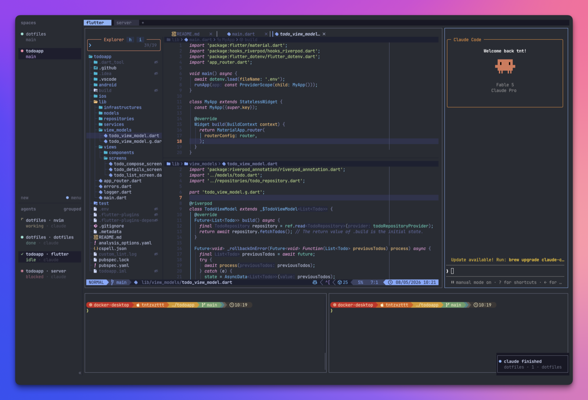

<!-- markdownlint-disable-file MD041 -->

<div align="center">
  <h1>dotfiles</h1>
  
  <p>
    Personal customization of a macOS terminal environment (herdr, Starship, tmux, Ghostty, etc.),<br/>
    managed with GNU Stow.
  </p>
</div>

## About

This repository stores configuration files for various tools and applications.
The configs live under `~/dotfiles/.config/` and are symlinked into `~/.config/`
using [GNU Stow](https://www.gnu.org/software/stow/), so the actual files are
version-controlled here while the tools find them at their expected paths.

Each managed directory under `.config/` is symlinked into `~/.config/` as a
whole, so files you add under it later are picked up without re-running GNU Stow.

> [!TIP]
> The trade-off of folding whole directories is that tools write their runtime
> files (plugins, logs, sockets, session state) back into this repo's working
> tree (they are git-ignored). Disabling folding with `--no-folding` would keep
> those out of the repo, but then every file added under a managed directory
> would need another `stow` run to be linked — so folding is kept on for
> convenience.

Developing or forking this repo? See [CONTRIBUTING.md](CONTRIBUTING.md).

## Requirements

- **macOS**
- **git** — to clone the repository (with submodule support)
- **[Homebrew](https://brew.sh)** — to install everything else

Everything the configs need — GNU Stow (for the symlinks), the managed tools
(fish, tmux, herdr, Neovim, Helix, Starship), the JetBrainsMono Nerd Font (set
as `font-family` in the [Ghostty config](.config/ghostty/config)), and `jq`
(used by [the `ide` fish function](./.config/fish/functions/ide.fish) to build
the herdr pane layout) — is listed in the [`Brewfile`](Brewfile) and installed
in the [Install](#install) step below.

## Install

1. **Clone the repository** to `~/dotfiles`:

   ```sh
   git clone --recurse-submodules https://github.com/tntzxzttt/dotfiles.git ~/dotfiles
   ```

   The `--recurse-submodules` flag pulls in the submodules — the Neovim config
   and [oh-my-tmux](https://github.com/gpakosz/.tmux) (which the tmux config
   symlinks into) — that the installer needs.

2. **Install the tools and dependencies**:

   ```sh
   cd ~/dotfiles
   brew bundle --no-upgrade
   ```

   This installs everything listed in the [`Brewfile`](Brewfile): GNU Stow, the
   managed tools, the Nerd Font, and `jq`. `--no-upgrade` installs what is
   missing without upgrading tools you already have (`brew bundle` upgrades
   outdated dependencies by default).

3. **Run the installer**:

   ```sh
   ./install.sh
   ```

   It checks out submodules, then symlinks this repo's files into `~/.config/`.
   Any existing config that would be overwritten is first moved aside to
   `~/.config/<tool>.<timestamp>.bak`, so nothing you already have is lost.

> [!NOTE]
> Adopting these dotfiles means starting from this repo's setup rather than
> merging your own — an existing herdr or tmux user does not carry over their
> previous environment; it is kept in the `*.bak` directory for reference only.

## Uninstall

Remove the symlinks created by GNU Stow:

```sh
cd ~/dotfiles
stow --target="$HOME/.config" -D .config
```

Restore anything you need from the `*.bak` directories the installer left
behind.

## Terminal multiplexers

> [!WARNING]
> In this dotfiles project, we deliberately avoid nesting tmux and herdr in one
> another; the two are used as alternatives.

herdr is itself a multiplexer, and it only tracks AI agents (e.g. `claude`) in
the panes it owns: each agent reports to the herdr server through a per-pane
hook that runs only when herdr's own environment is present. Mixing it with
tmux therefore creates blind spots:

- **tmux inside herdr** — herdr sees the whole tmux as a single pane, so it
  cannot tell apart or drive the agents running in tmux's own panes.
- **herdr inside tmux** — redundant, since herdr already provides the tabs,
  panes, and workspaces tmux would add, all from a shared server that any
  client just attaches to. Worse, an agent started in a bare tmux pane never
  sets herdr's environment, so herdr never sees it; running every agent under
  herdr keeps them all visible in one place.

Additionally, staying unnested lets their prefix and keybindings be unified
(prefix `ctrl+y`, `alt+hjkl` pane navigation, `alt+v` copy mode), so tmux and
herdr feel identical to operate.

## Customization

### fish

See [`./.config/fish/README.md`](./.config/fish/README.md) for details on
`conf.d/` conventions and runtime dependencies (e.g. Bash 5.x for SDKMAN!).

### Machine-local functions

| Directory          | Tracked          | Purpose                                             |
| ------------------ | ---------------- | --------------------------------------------------- |
| `functions/`       | Yes              | Version-controlled functions shared across machines |
| `functions.local/` | No (git-ignored) | Machine-specific functions that stay local          |

`functions.local/` is registered on `$fish_function_path` by
`conf.d/00-autoload-local-functions.fish` and is prepended so that a local
function can override a tracked one of the same name.

> **Note on `funcsave`:** `funcsave` (and `funced --save`) always writes to
> `~/.config/fish/functions/`, the tracked directory. It does not honor the
> priority order of `$fish_function_path`, so a function saved this way is
> created as a new tracked file and will appear in `git status`. For a
> machine-local function, do not rely on `funcsave`; create or move the file
> under `functions.local/` by hand.

### Go

In [`./.config/fish/conf.d/01-path.fish`](./.config/fish/conf.d/01-path.fish):

- `GOPATH` is set to `~/.go`
- `$GOPATH/bin` is added to `PATH`

This keeps the home directory visually cleaner by avoiding a visible `~/go` directory.

## Contributing

This repository is maintained as a personal development environment and
engineering log, so external issues and pull requests aren't accepted — feel
free to fork it. See [CONTRIBUTING.md](CONTRIBUTING.md) for how the repo is
structured and maintained.

## License

[MIT](LICENSE)
